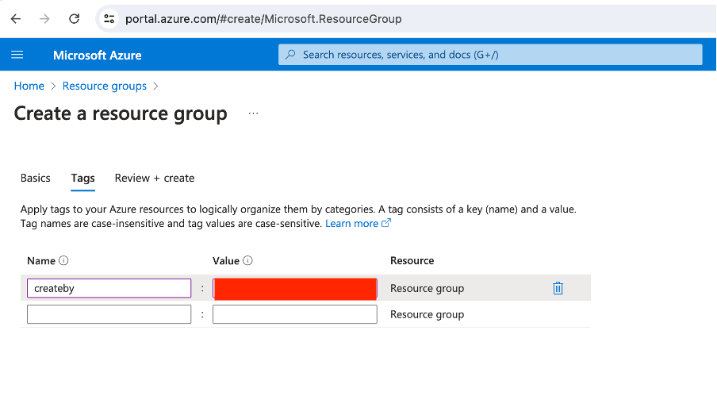
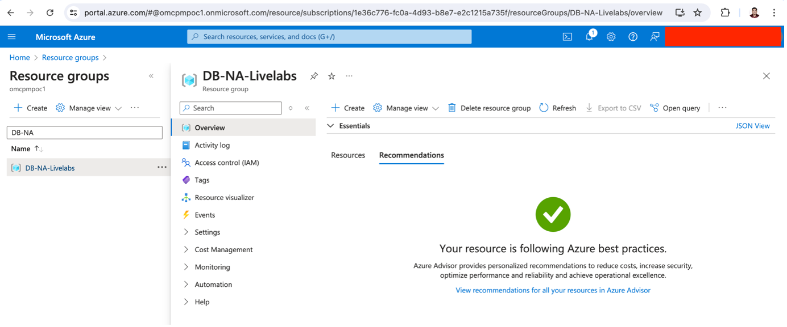

# Pre-requisiteis to provision an Autonomous Transaction Processing Database@Azure

## Introduction

This lab walks you through the steps to get started using the Oracle Autonomous Database@Azure. 

Pre-requisites before provisioning Autonomous Database@Azure.

Estimated Time: 20 minutes

### Objectives

As a database user, DBA or application developer:

1. Create Resource Group and Virtual Network in Azure portal.

## Task 1: Create a Resource Group

In this section, you will create a resource group and VNet as a pre-requisite steps before provisioiong ADB@Azure.

1.	Login to Azure Portal (portal.azure.com) and navigate to All services. Then click on Resource groups icon.

    

2.	On ‘Resource groups’ page, click on ‘Create’ button.

    

3.	On “Create resource groups’ provide details in each tab as mentioned in below screenshot. 
    Basics:
    a.	Subscription – select your billing subscription in directory you selected
    b.	Resource group – Enter the name for resource group to be created
    c.	Region – Select your region from the drop-down list

    

    Tags
    Provide inputs to organize your resource with tagging as shown in below screenshot
    a.	Name
    b.	Value
    
    

    On Review + create page, it will validate the inputs provided in previous steps. Once Validation is passed, it will create a resource group.

    

4.	Navigate to Resource groups from ‘Home screen’ and search for the Resource group created to validate as shown in below screenshot

    

## Task 2:  Create Virtual Network (VNet)
1. Navigate to ‘Azure Services’ and select Virtual networks. Then click on Create button

2.	Create Virtual Network page will appear. Provide all required details as shown in below screenshot for each tab
    
    Project Details:
    * **Subscription:**
    * **Resource group**
    
    Instance Details
    * **Virtual network name**
    * **Region**

     Security
    * **Virtual Network encryption:** Select Virtual Network Encryption checkbox to enable the encryption of the traffic traveling within the VNet

    * **Azure Bastian:** Select Enable Azure Bastian checkbox if Bastian Server is required to connect to specific resource later.

    * **Azure Firewall:** Similar to traffic encryption and Bastian service, you can enable the Azure Firewall if required.

    * **IP Addresses:** There is an option to choose IPV4/IPV6 addresses for your network resources. 
    Select default IP Address range or provide new Ip range based on the requirement. Here we are using default IP range for IP addresses as shown in below screenshot.

    Tags
    
    Provide inputs to organize your resource with tagging as shown in below screenshot
    * **Name**
    * **Value**

    On * **Review + create page**, it will validate the inputs provided in previous steps. Once Validation is passed, it will create virtual network.

    Deployment can be monitored as below.

    Once all required resources are created for virtual network, deployment status will get changed to * **‘Complete’**.

    Navigate to **Virtual Network** and search for the name of the VNet created to see details about the virtual cloud network.

You may now **proceed to the next lab** to provision Autonomous Database@Azure.

## Acknowledgements

*All Done! You have successfully created Resource Group and Virutal Network.*

- **Author** - Sanjay Rahane, Principal Cloud Architect, North America Cloud Engineering Services (CES)

- **Last Updated By/Date** - Sanjay Rahane, July 2024

## See an issue or have feedback?  
Please submit feedback [here](https://apexapps.oracle.com/pls/apex/f?p=133:1:::::P1_FEEDBACK:1).   Select 'Autonomous DB on Dedicated Exadata' as workshop name, include Lab name and issue / feedback details. Thank you!
