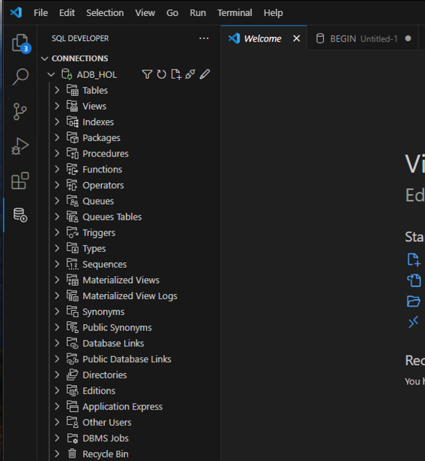
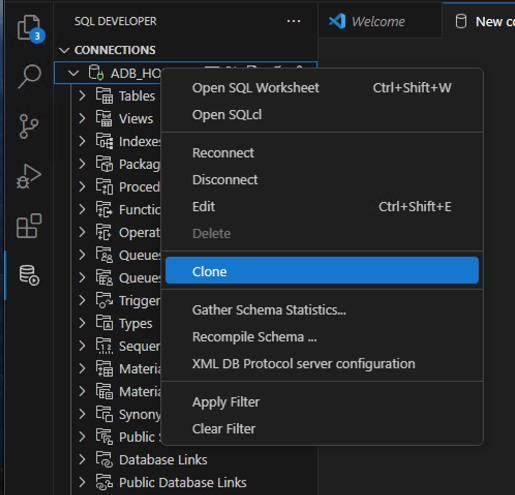
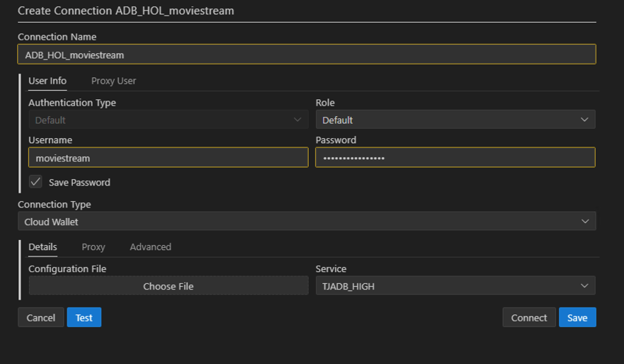
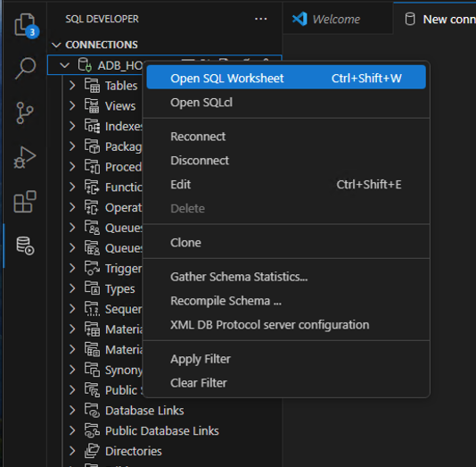
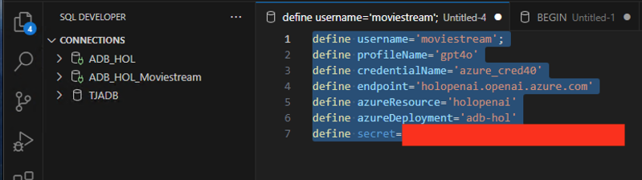
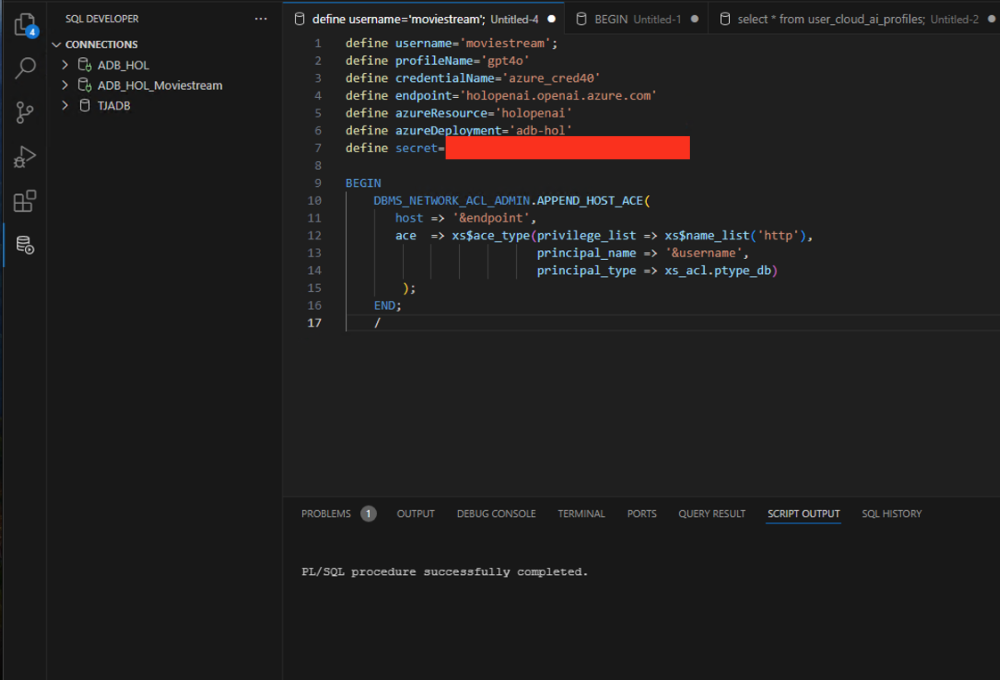
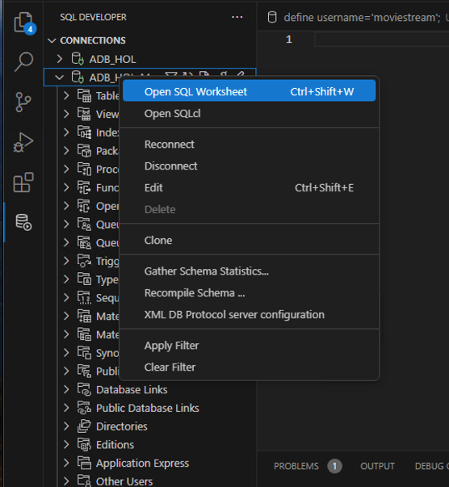
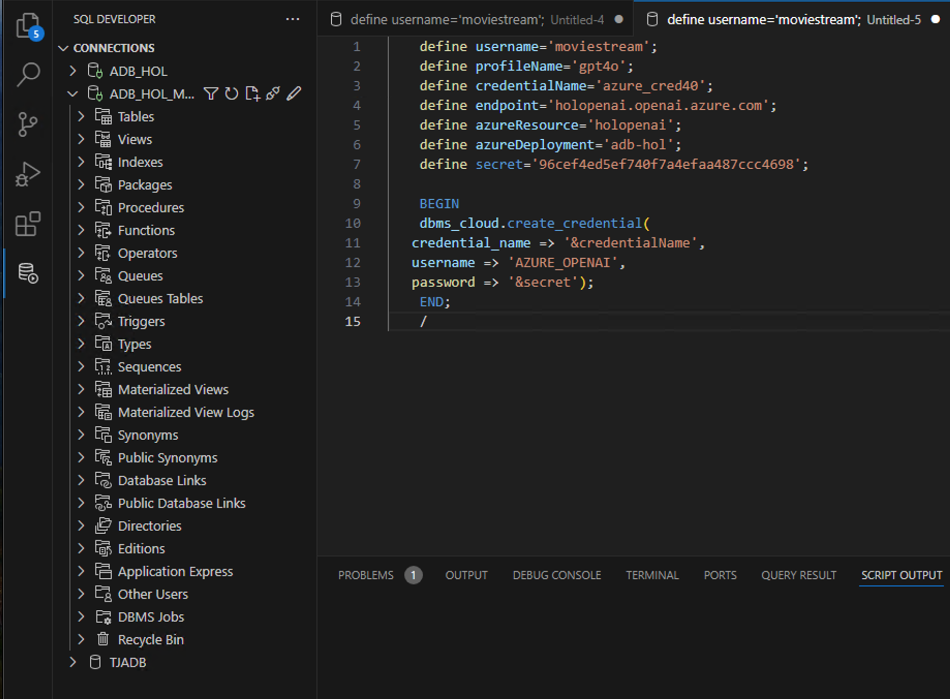
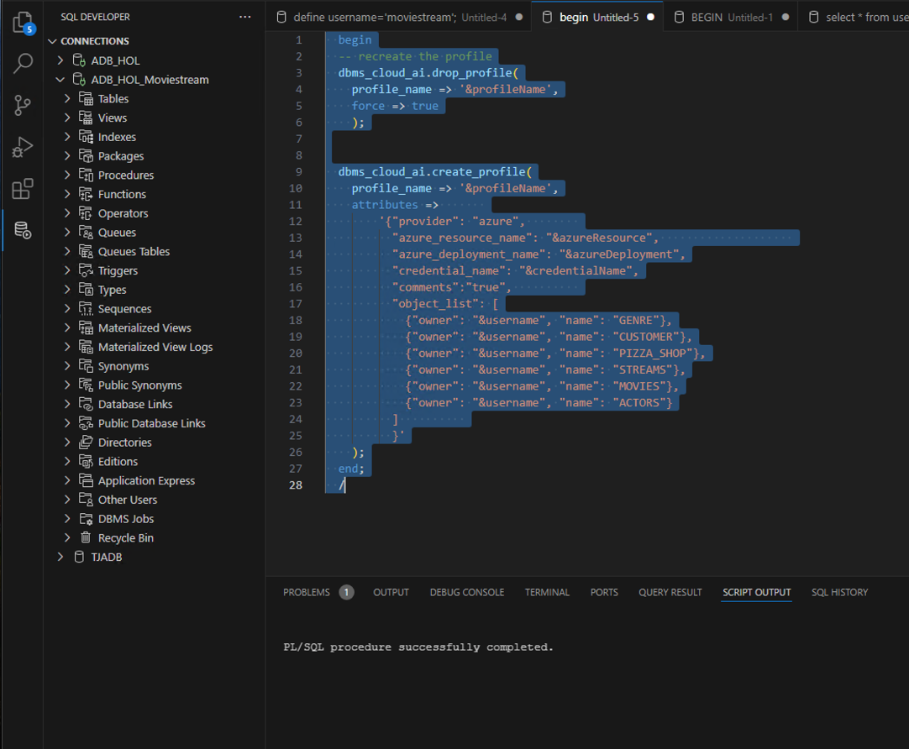

# Provisioning an Autonomous Database Instance

## Introduction

In this lab, you will learn how to use Autonomous Database Select AI (Select AI) to query your data using natural language; you don't need prior knowledge of the data structure or how that data is accessed.

What is Natural Language Processing?
Natural language processing is the ability of a computer application to understand human language as it is spoken and written. It is a component of artificial intelligence (AI).

What is Generative AI?
Generative AI enables users to quickly generate new content based on a variety of inputs. Inputs and outputs to these models can include text, images, sounds, animation, 3D models, and other types of data.

Estimated Time: 20 minutes

### Objectives

1. Configure your Autonomous Database to leverage a generative AI model for querying data using natural language
2. Use Select AI to query data using natural language

Oracle MovieStream Business Scenario

The lab's business scenario is based on Oracle MovieStream - a fictitious movie streaming service that is similar to services to which you currently subscribe. You'll be able to ask questions about movies, customers who watch movies, and the movies they decide to watch.

### Required Artifacts

- An Azure account with a pre-provisioned Autonomous Database and Azure OpenAI.
- You have imported the data from the sample data pump file (Refer to Lab 3: Migrate to ADB using Data pump)

## Task 1: Integrate Azure OpenAI with Autonomous Database

Autonomous Database supports models from OCI Generative AI, Azure OpenAI, OpenAI, and Cohere. This workshop will use the Azure OpenAI model.

1.	Login to your Microsost Windows Virtual machine and open Visual studio with Autonomous Database.


    

-  Right click on your Database connection and clone the connection to add ***moviestream*** user connection.

- Enter the connection name, Username and password and click ***Save***.

    

     

- Right click on the connection (Admin) again and Open SQL Worksheet in Oracle Autonomous Database Service details page.

    


***Note: You will be executing the below sql queries as ***Admin*** user***

***Create an AI Profile for OCI Generative AI***

- A Select AI profile encapsulates connection information for an AI provider. This includes:
1. A security credential (e.g. the resource principal)
2. The name of the provider
3. The name of the LLM (optional)
4. A list of target tables that will be used for natural language queries (required when using NL2SQL) You can create as many profiles as you need, which is useful when comparing the quality of the results of different models.

For a complete list of the Select AI profile attributes, see the [DBMS_CLOUD_AI_Package](https://docs.oracle.com/en/cloud/paas/autonomous-database/serverless/adbsb/dbms-cloud-ai-package.html#GUID-D51B04DE-233B-48A2-BBFA-3AAB18D8C35C) in the Using Oracle Autonomous Database Serverless documentation.

-  Define the variables (Run the below as Admin user). [Get your Azure API key from here](https://tjdatapump.blob.core.windows.net/holcontainer/secret.txt)

    ```
    select * from user_cloud_ai_profiles;
    define username='moviestream';
    define profileName='gpt4o';
    define credentialName='azure_cred40';
    define endpoint='holopenai.openai.azure.com';
    define azureResource='holopenai';
    define azureDeployment='adb-hol';
    define secret='Azure API key';
    ```
    
    

- As ADMIN, you will open up the azure openai endpoint so that ***moviestream*** user can make connections to it.
 
     ```
     BEGIN                                                                          
    DBMS_NETWORK_ACL_ADMIN.APPEND_HOST_ACE(                                      
       host => '&endpoint',
       ace  => xs$ace_type(privilege_list => xs$name_list('http'),             
                           principal_name => '&username',                          
                           principal_type => xs_acl.ptype_db)                 
        );                                                                            
    END;                                                                           
    /
    ```  

    


- Now log in as the ***moviestream*** that will be using generative AI.
Create a credential that allows the user to access the Azure OpenAI endpoint

***NOTE: Note: the MOVIESTREAM user was created as part of the setup and tables that were created in that schema. Moviestream password ***'watchS0meMovies#'***.***

-  Right click on ***moviestream*** connection in your Visual Studio and Open SQL Worksheet. 

    

***Note: Please enter the Secret key that you downloaded earlier in the Lab.***

    ```
    define username='moviestream';
    define profileName='gpt4o';
    define credentialName='azure_cred40';
    define endpoint='holopenai.openai.azure.com';
    define azureResource='holopenai';
    define azureDeployment='adb-hol';
    define secret='Azure API key';

    BEGIN                                                                          
    dbms_cloud.create_credential(                                                 
   credential_name => '&credentialName',                                            
   username => 'AZURE_OPENAI',                                                 
   password => '&secret');                            
    END;                                                                           
    /
    ```




-  Create an AI profile for the Azure OpenAI model. Copy and paste the following code into your SQL Worksheet, and then click the Run Script icon..

```
    begin
  -- recreate the profile
  dbms_cloud_ai.drop_profile(
    profile_name => '&profileName',
    force => true
    );


  dbms_cloud_ai.create_profile(
    profile_name => '&profileName',
    attributes =>       
        '{"provider": "azure",        
          "azure_resource_name": "&azureResource",                    
          "azure_deployment_name": "&azureDeployment",
          "credential_name": "&credentialName",
          "comments":"true",          
          "object_list": [
            {"owner": "&username", "name": "GENRE"},
            {"owner": "&username", "name": "CUSTOMER"},
            {"owner": "&username", "name": "PIZZA_SHOP"},
            {"owner": "&username", "name": "STREAMS"},
            {"owner": "&username", "name": "MOVIES"},
            {"owner": "&username", "name": "ACTORS"}
          ]          
          }'
    );
  end;
  /
```




## Task 2: Test the AI profile

- We will use the PL/SQL API to generate a response from the Cohere model. This example is using the chat action. It is not using any private data coming from your database.

1. Test the LLM and learn about Autonomous Database as the MOVIESTREAM user. Copy and paste the following code into your SQL Worksheet, and then click the Run Script icon.

```
select ai chat what is autonomous database;
```


You may now **proceed to the next lab**.

## Acknowledgements

*All Done! You have successfully deployed your Autonomous Database instance and it should be available for use in a few minutes.*

- **Author** - Tejus Subrahmanya
- **Last Updated By/Date** - Tejus Subrahmanya, July 2024

## See an issue or have feedback?  
Please submit feedback [here](https://apexapps.oracle.com/pls/apex/f?p=133:1:::::P1_FEEDBACK:1).   Select 'Autonomous DB on Dedicated Exadata' as workshop name, include Lab name and issue / feedback details. Thank you!
