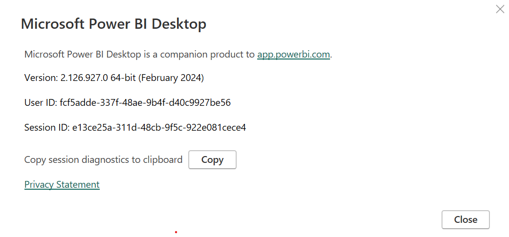
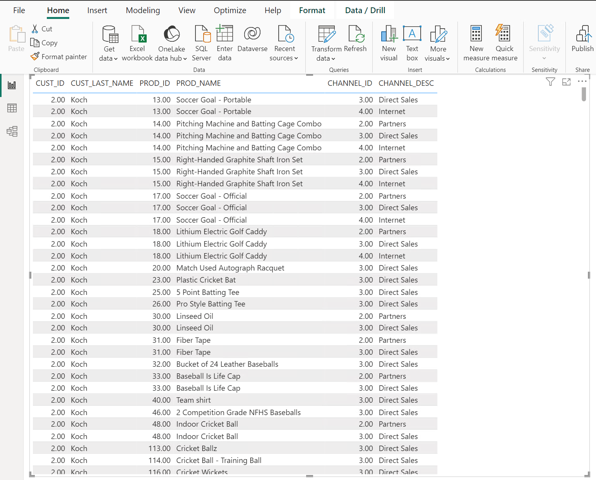
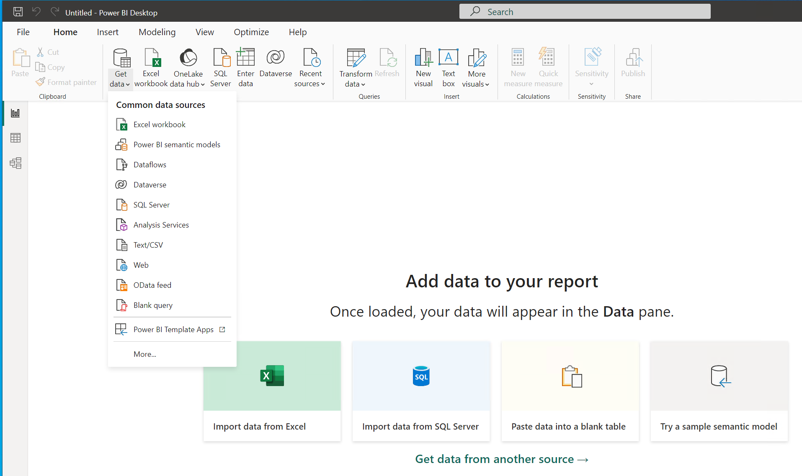
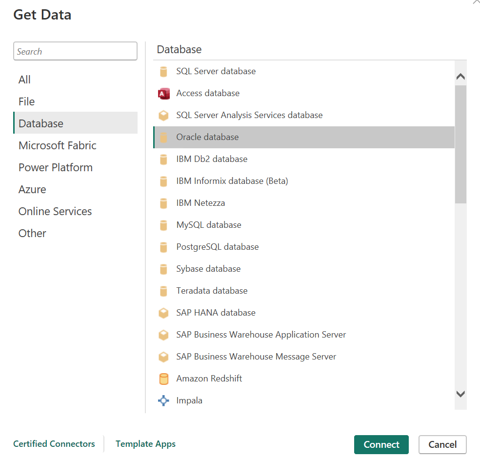
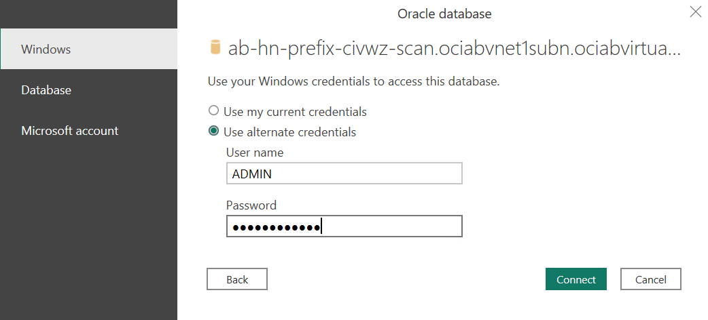
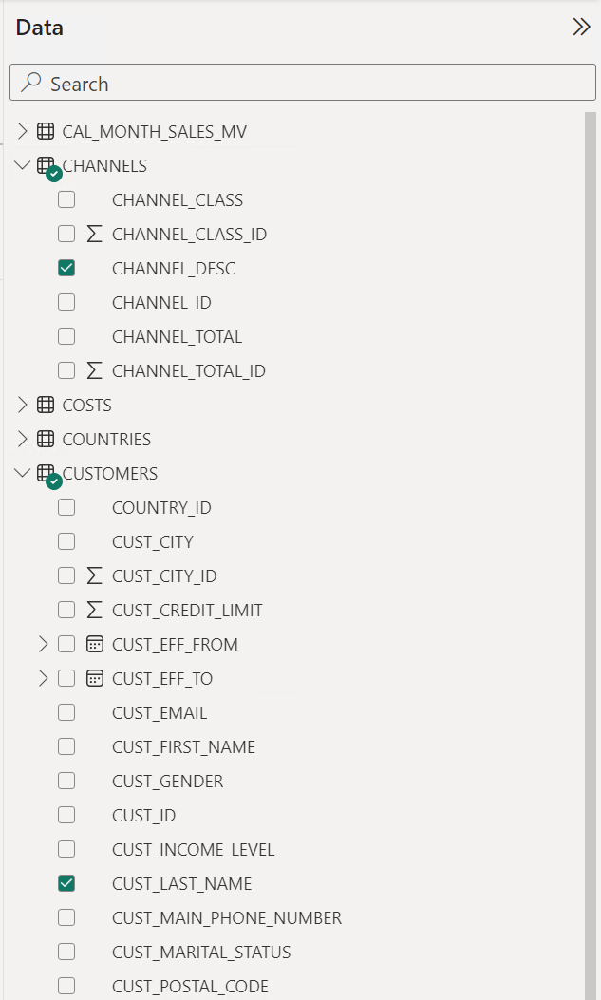
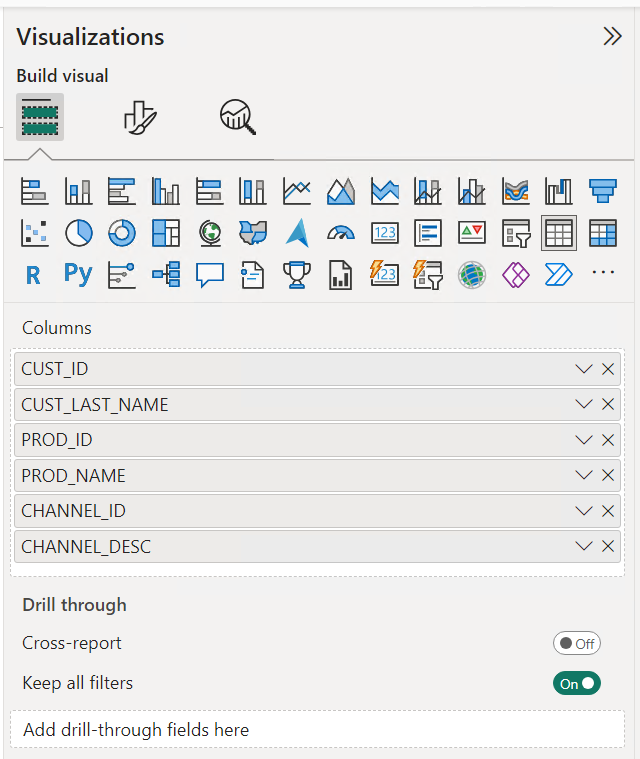

# Connecting Power BI Desktop to an Oracle Autonomous Database in Oracle Database@Azure 

## Introduction
Power BI Desktop is is a free application you install on your designated Windows machines that lets you connect to, transform, and visualize your data. With Power BI Desktop, you can connect to multiple different sources of data to build visuals, and collections of visuals you can share as reports.

Oracle Database@Azure is an Oracle and Microsoft partnership solution that delivers Oracle database services running on Oracle Cloud Infrastructure (OCI), collocated in Microsoft Azure data centers. Azure customers can now procure, deploy, and use Oracle database services running on OCI within the native Azure portal and APIs, giving them an OCI-in-Azure-like experience. 

This lab allows you to connect Power BI Desktop to an Oracle Database in Oracle Database@Azure to retrieve data and generate reports.

Estimated Time: 10-15 minutes

### Objectives

As a developer or DBA:

1. Access the OCI Autonomous Database console and get the URL for the Database Actions console.
2. Create a VNC connection to the developer client VM and access the Database Actions console.
3. Access Performance Hub for your Autonomous Database instance.

### Required Artifacts
- An Oracle Cloud Infrastructure account with access to Autonomous Transaction Processing console.
- A pre-provisioned Autonomous Database with admin access.
- A pre-provisioned developer client machine with network access to the database.

## Task 1: Verify that Power BI Desktop is installed in your Virtual Machine

1. Open Power BI

2. Click File -> About

3. Verify it is the 64-bit version

  

## Task 2: Verify that the Oracle Client for Microsoft Tools is installed

- Look in the directory

- Run command 

## Task 3: Set up a connection to an Autonomous database

  1. Open Power BI Desktop

    

  2. Click **Get Data** and select **More** at the bottom of the list

    

  3. Select **Database** on the left side menu

  4. Select **Oracle database** from the list

    

  5. Enter the **Server** in the following format:

    oracle-database-server-name:port-number/service-name

  6. Check the **DirectQuery** radio button
    
  7. Click **OK**

  8. Check the **Use alternate credentials** radio button

  9. Enter **User name** and **Password**

    

  10. Click **Connect**

## Task 4 Build your report

  1. Select the **data** build your Microsoft Power BI Desktop report by checking column names within each database table

    

  2. Select your desired **Visualization** (table) by examining option under **Visualizations** 

    

## Task 5 Review your generated report and adjust properties as needed

  

## References

    * https://www.oracle.com/a/ocom/docs/database/microsoft-powerbi-connection-adw.pdf
    * https://learn.microsoft.com/en-us/power-bi/connect-data/desktop-connect-oracle-database

You may now **proceed to the next lab**.

## Acknowledgements

*Fantastic! You successfully learned to use the Database Actions Console and Performance Hub on your Autonomous Database instance.*

- **Author** - Anwar Belayachi
- **Last Updated By/Date** - August 14, 2024

## See an issue or have feedback?  
Please submit feedback [here](https://apexapps.oracle.com/pls/apex/f?p=133:1:::::P1_FEEDBACK:1).   Select 'Autonomous DB on Dedicated Exadata' as workshop name, include Lab name and issue/feedback details. Thank you!
